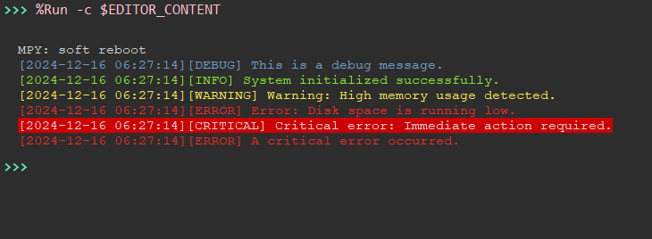

# ulogger - A Lightweight Logger for MicroPython

## Overview

`ulogger` is a lightweight logging system designed for MicroPython environments. It allows you to log messages at different severity levels, output logs to both the console and a file, and supports log rotation based on file size. The system is flexible and can be configured to use color-coded logs for the console and store logs in either text or JSON format. It is optimized for use on embedded systems and microcontrollers where resources are limited.

## Features

- **Multiple log levels**: Supports various log levels including DEBUG, INFO, WARNING, ERROR, CRITICAL, and TRACE.
- **Color-coded console output**: Log messages in the console are color-coded for better visibility and differentiation based on severity.
- **File logging**: Logs can be written to a file in either text or JSON format.
- **Log rotation**: If the log file exceeds a certain size, it will be automatically rotated (older logs are renamed).
- **Timestamping**: Each log entry includes a timestamp in the format `YYYY-MM-DD HH:MM:SS`.
- **Flexible log level management**: You can set the minimum log level dynamically and filter out lower-level messages.
- **Disable logging**: You can completely disable logging when necessary.

## Installation

This module is designed to work with MicroPython, and can be used in any MicroPython project. Simply copy the `Logger` class into your project and use it directly.

## Usage

### Example:

```python
from logger import Logger

# Create a Logger instance with the desired settings
logger = Logger(
    level="DEBUG",          # Set default log level to DEBUG
    log_to_console=True,    # Enable logging to console
    log_to_file=True,       # Enable logging to file
    file_name="app_log.txt", # Name of the log file
    max_file_size=1024,     # Maximum log file size in bytes before rotation
    use_colors=True,        # Use color coding in console logs
    log_format="text"       # Log format, can be "text" or "json"
)

# Logging messages at different levels
logger.debug("This is a debug message.")
logger.info("System initialized successfully.")
logger.warning("Warning: High memory usage detected.")
logger.error("Error: Disk space is running low.")
logger.critical("Critical error: Immediate action required.")
logger.trace("Trace message for detailed debugging.")

# Changing the log level to ERROR, which will ignore lower levels (INFO, DEBUG)
logger.set_level("ERROR")
logger.info("This message will not be logged.")
logger.error("A critical error occurred.")

# Disabling all logging
logger.disable()
logger.error("This message will not be logged.")
```

## Logger Class Overview

### `__init__(self, level="INFO", log_to_console=True, log_to_file=False, file_name="log.txt", max_file_size=0, use_colors=True, log_format="text")`

- **level**: Set the default log level (one of `DEBUG`, `INFO`, `WARNING`, `ERROR`, `CRITICAL`).
- **log_to_console**: Boolean flag to log messages to the console.
- **log_to_file**: Boolean flag to log messages to a file.
- **file_name**: Name of the log file when logging to file.
- **max_file_size**: Maximum file size in bytes before rotating the log file (0 means no rotation).
- **use_colors**: Boolean flag to enable color-coded output in the console.
- **log_format**: The format of the log file, either "text" or "json".

## Log Levels

The logger supports the following log levels:

- **DEBUG**: Detailed debug messages.
- **INFO**: General information messages.
- **WARNING**: Warnings about potential issues.
- **ERROR**: Errors that need attention.
- **CRITICAL**: Critical errors requiring immediate action.
- **TRACE**: Trace messages for detailed debugging (lowest level).

## Methods

- **set_level(level)**: Set the logging level to control the severity of messages logged.
- **debug(message)**: Log a message at the `DEBUG` level.
- **info(message)**: Log a message at the `INFO` level.
- **warning(message)**: Log a message at the `WARNING` level.
- **error(message)**: Log a message at the `ERROR` level.
- **critical(message)**: Log a message at the `CRITICAL` level.
- **trace(message)**: Log a message at the `TRACE` level.
- **disable()**: Disable all logging (no messages will be logged).

## Log File Format

### Text Format
Each log entry consists of the following format:
```
[YYYY-MM-DD HH:MM:SS][LEVEL] message
```

Example:
```
[2024-12-16 14:23:45][INFO] System initialized successfully.
```

### JSON Format
Each log entry is a JSON object with the following fields:
```json
{
  "timestamp": "YYYY-MM-DD HH:MM:SS",
  "level": "LEVEL",
  "message": "message",
  "color": "color_code"  // Only included for console logs with colors enabled
}
```

Example:
```json
{
  "timestamp": "2024-12-16 14:23:45",
  "level": "INFO",
  "message": "System initialized successfully.",
  "color": "\u001b[92m"
}
```

## Notes

- **File Rotation**: When the log file exceeds the defined size (`max_file_size`), the file is rotated and renamed with a `.old` suffix.
- **Compatibility**: This logger is designed for MicroPython environments and works on microcontrollers like ESP32, ESP8266, and other low-resource systems.
- **Error Handling**: The logger gracefully handles errors when writing to files or rotating logs, ensuring that logging continues without disruption.

## License

ulogger is licensed under the MIT License. See the LICENSE file for more details.

## Test Images


